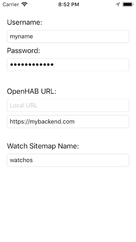
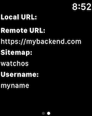
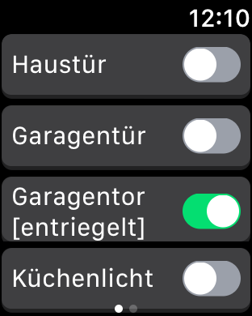
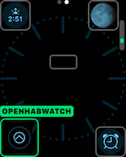

# openhabwatch

This is a simple client for the OpenHAB Home Automation Bus. You can use the app to bring simple switch items on a sitemap to your Apple Watch.

# Sitemap Example

You can define a special sitemap for your apple watch. Right now only a single frame can be displayed, but with future versions, we would like to support multiple frames in your sitemap.

Here is a simple example how you can define your sitemap **watchos.sitemap**:

```
sitemap default label="Watch"
{
        Switch item=KeyMatic_Open label="Haustuer"
        Switch item=Garagentor_Taster label="Garagentuer"
        Switch item=KeyMatic_Garage_State label="Garagentor"
        Switch item=Licht_EG_Kueche label="Kuechenlicht"
}
```

In your openhabwatch iOS App, add the sitemap to your connection params:



If the remote URL has been entered it will always used. The local URL will right now only be used when a remote URL is missing.

You should see these parameters in your watch afterwards:



And the switch buttons on the first apple watch page:



To quickly access the app, you can add the openhabwatch complication to your watch face:



